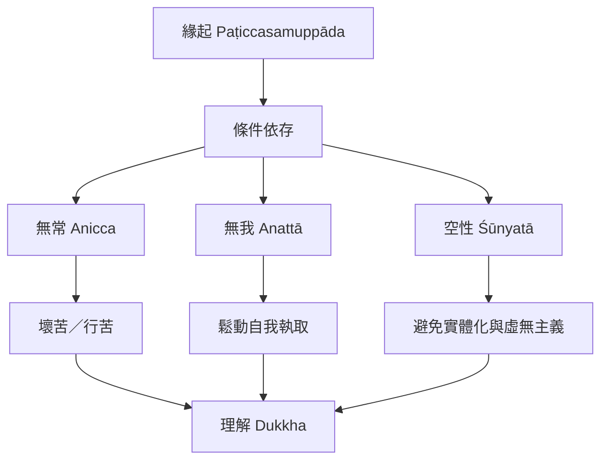

這張地圖把緣起、無常、無我與空性放在同一脈絡中：現象依條件形成，因而變動、無獨立自性，也因此可能被理解與改變。

```mermaid
flowchart TD
  A[緣起 Paṭiccasamuppāda] --> B[條件依存]
  B --> C[無常 Anicca]
  B --> D[無我 Anattā]
  B --> E[空性 Śūnyatā]
  C --> F[壞苦／行苦]
  D --> G[鬆動自我執取]
  E --> H[避免實體化與虛無主義]
  F --> I[理解 Dukkha]
  G --> I
  H --> I

```

* [[緣起（Paṭiccasamuppāda）]]
* [[無常（Anicca）]]
* [[無我（Anattā）]]
* [[空性（Śūnyatā）]]
* [[行苦（Saṅkhāra-dukkhatā）]]
* [[空性不否定現象而否定獨立自性]]
