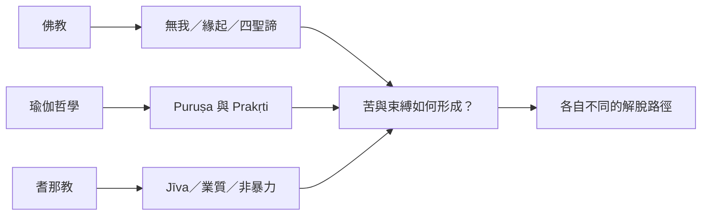

此圖比較佛教、瑜伽哲學與耆那教對苦與解脫的不同解釋；共通關懷不表示它們對自我、業與解脫具有相同形上學。

```mermaid
flowchart LR
  A[佛教] --> A1[無我／緣起／四聖諦]
  B[瑜伽哲學] --> B1[Puruṣa 與 Prakṛti]
  C[耆那教] --> C1[Jīva／業質／非暴力]
  A1 --> D[苦與束縛如何形成？]
  B1 --> D
  C1 --> D
  D --> E[各自不同的解脫路徑]

```

* [[不同印度傳統以不同形上學理解苦與解脫]]
* [[瑜伽哲學的苦（Yoga Duḥkha）]]
* [[耆那教靈魂（Jīva）]]
* [[業（Karma，耆那哲學）]]
* [[空性（Śūnyatā）]]
