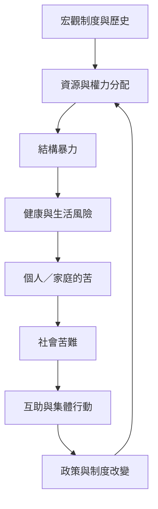

社會與制度地圖把個人痛苦放回家庭、社群、政策、資源與歷史脈絡中，避免將結構性問題縮減成個體認知或意志力不足。

```mermaid
flowchart TD
  A[宏觀制度與歷史] --> B[資源與權力分配]
  B --> C[結構暴力]
  C --> D[健康與生活風險]
  D --> E[個人／家庭的苦]
  E --> F[社會苦難]
  F --> G[互助與集體行動]
  G --> H[政策與制度改變]
  H --> B

```

* [[社會苦難（Social suffering）]]
* [[結構暴力（Structural violence）]]
* [[氣候焦慮（Climate anxiety）]]
* [[慈悲（Karuṇā）]]
* [[苦的減輕同時需要內在訓練與外在條件改變]]
