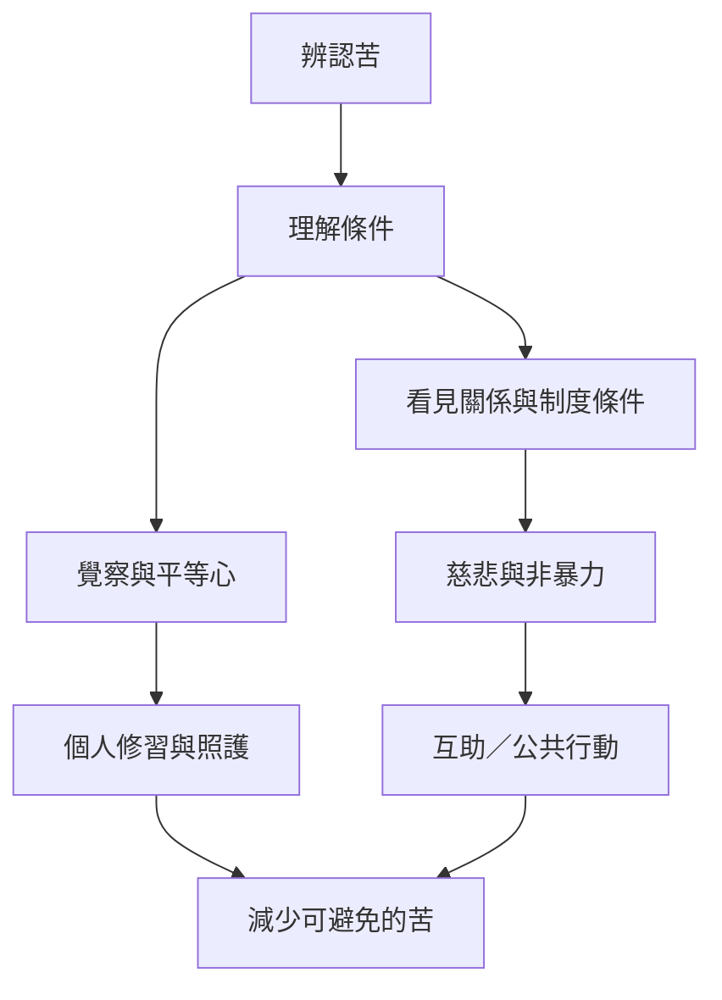

這張地圖將個人覺察、平等心與八正道，連結到慈悲、互助與制度改變，避免把減苦限制在單一層次。

```mermaid
flowchart TD
  A[辨認苦] --> B[理解條件]
  B --> C[覺察與平等心]
  C --> D[個人修習與照護]
  B --> E[看見關係與制度條件]
  E --> F[慈悲與非暴力]
  F --> G[互助／公共行動]
  D --> H[減少可避免的苦]
  G --> H

```

* [[四聖諦（Ariyasacca）]]
* [[平等心（Upekkhā）]]
* [[慈悲（Karuṇā）]]
* [[非暴力（Ahiṃsā）]]
* [[入世佛教（Engaged Buddhism）]]
* [[苦的減輕同時需要內在訓練與外在條件改變]]
