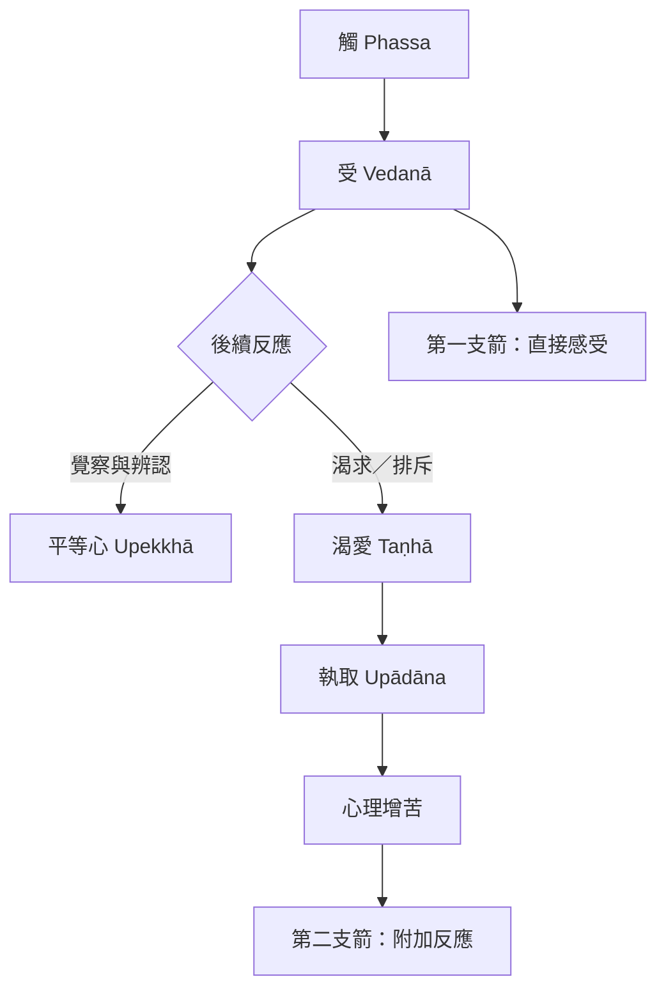

這張地圖聚焦從感官接觸到感受、渴愛與反應的過程，並以兩支箭譬喻區分直接感受與後續增苦。

```mermaid
flowchart TD
  A[觸 Phassa] --> B[受 Vedanā]
  B --> C{後續反應}
  C -->|覺察與辨認| D[平等心 Upekkhā]
  C -->|渴求／排斥| E[渴愛 Taṇhā]
  E --> F[執取 Upādāna]
  F --> G[心理增苦]
  B --> H[第一支箭：直接感受]
  G --> I[第二支箭：附加反應]

```

* [[受（Vedanā）]]
* [[第二支箭（The second arrow）]]
* [[平等心（Upekkhā）]]
* [[渴愛（Taṇhā）]]
* [[執取（Upādāna）]]
* [[第二支箭說明心理增苦並非必然]]
