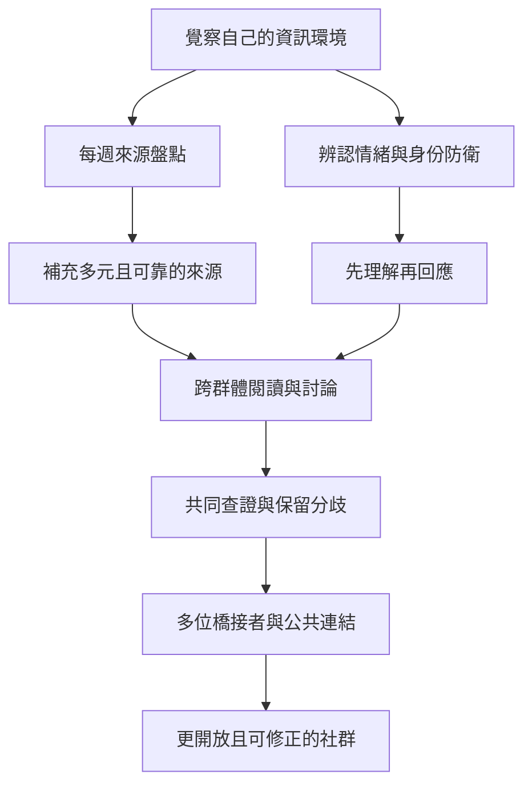

此圖把概念研究轉成個人與社群可操作的練習：資訊日誌、跨群閱讀、共同查證、內部異議與多位橋接者。

```mermaid
flowchart TD
 A[覺察自己的資訊環境] --> B[每週來源盤點]
 A --> C[辨認情緒與身份防衛]
 B --> D[補充多元且可靠的來源]
 C --> E[先理解再回應]
 D --> F[跨群體閱讀與討論]
 E --> F
 F --> G[共同查證與保留分歧]
 G --> H[多位橋接者與公共連結]
 H --> I[更開放且可修正的社群]
```

可以直接實踐 [[每週檢視自己的資訊來源比追求抽象的資訊中立更可行]]、[[先理解對方的理由再判斷是否同意能降低對話防衛]]、[[把資訊多元的評估從來源數量改成觀點與證據品質]]。

* 本概念地圖連回 [[Echo_chamber]]。
