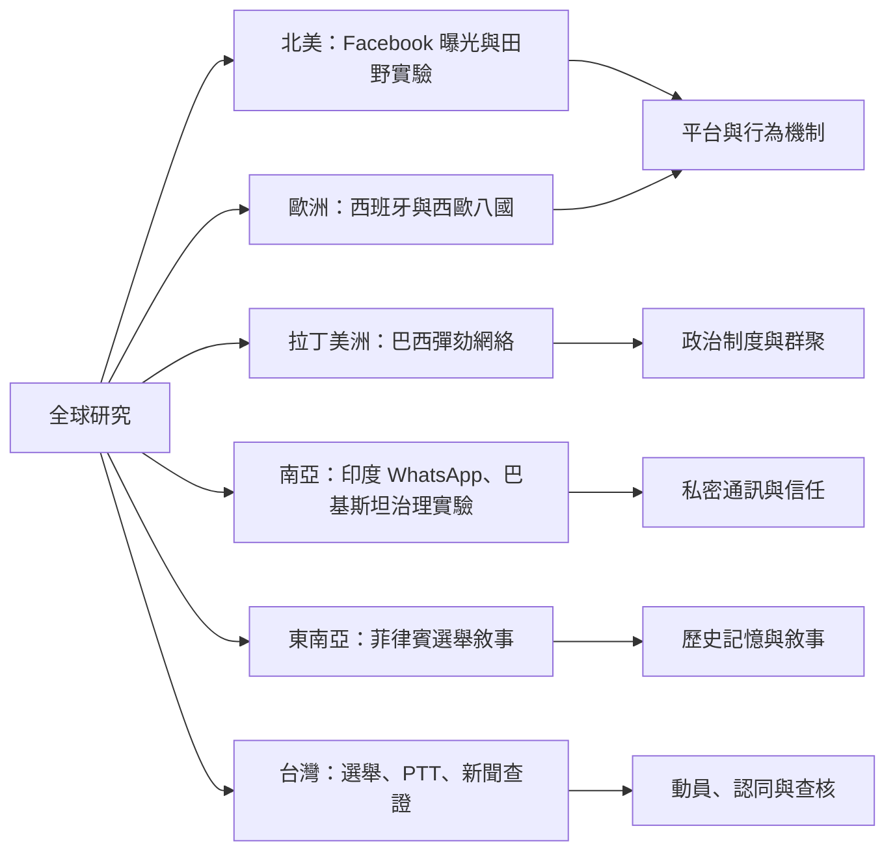

不同地區的回音室呈現不同的平台、語言、歷史與政治制度條件。案例涵蓋美國、歐洲、巴西、印度、菲律賓、巴基斯坦與台灣。此圖把案例放回比較研究，而非將美國經驗視為普遍模型。

```mermaid
flowchart LR
 A[全球研究] --> B[北美：Facebook 曝光與田野實驗]
 A --> C[歐洲：西班牙與西歐八國]
 A --> D[拉丁美洲：巴西彈劾網絡]
 A --> E[南亞：印度 WhatsApp、巴基斯坦治理實驗]
 A --> F[東南亞：菲律賓選舉敘事]
 A --> G[台灣：選舉、PTT、新聞查證]
 B --> H[平台與行為機制]
 C --> H
 D --> I[政治制度與群聚]
 E --> J[私密通訊與信任]
 F --> K[歷史記憶與敘事]
 G --> L[動員、認同與查核]
```

重要對讀：[[全球回音室研究的地理分布本身就是知識偏差]]、[[多黨制與媒體系統會改變同溫層的形狀]]、[[回音室會放大既有歷史敘事而非憑空創造認同]]。

* 本概念地圖連回 [[Echo_chamber]]。
