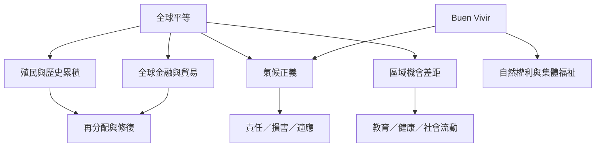

全球平等不只比較國家平均所得，也檢查歷史累積、全球金融安排、資本所有權、氣候責任與原住民族土地關係。全球資料應與地方經驗併讀，避免把宏觀統計當成每個社群的完整故事。

## 概念關係圖

```mermaid
flowchart TD
  A[全球平等] --> B[殖民與歷史累積]
  A --> C[全球金融與貿易]
  A --> D[氣候正義]
  A --> E[區域機會差距]
  D --> F[責任／損害／適應]
  B --> G[再分配與修復]
  C --> G
  E --> H[教育／健康／社會流動]
  I[Buen Vivir] --> D
  I --> J[自然權利與集體福祉]
```

## 導覽脈絡
[[Buen Vivir]]、[[代間正義]]、[[全球平等]]、[[再分配]]、[[反種姓運動]]、[[氣候正義]]、[[全球平等要求追問殖民歷史與跨國制度]]、[[社會流動]]
