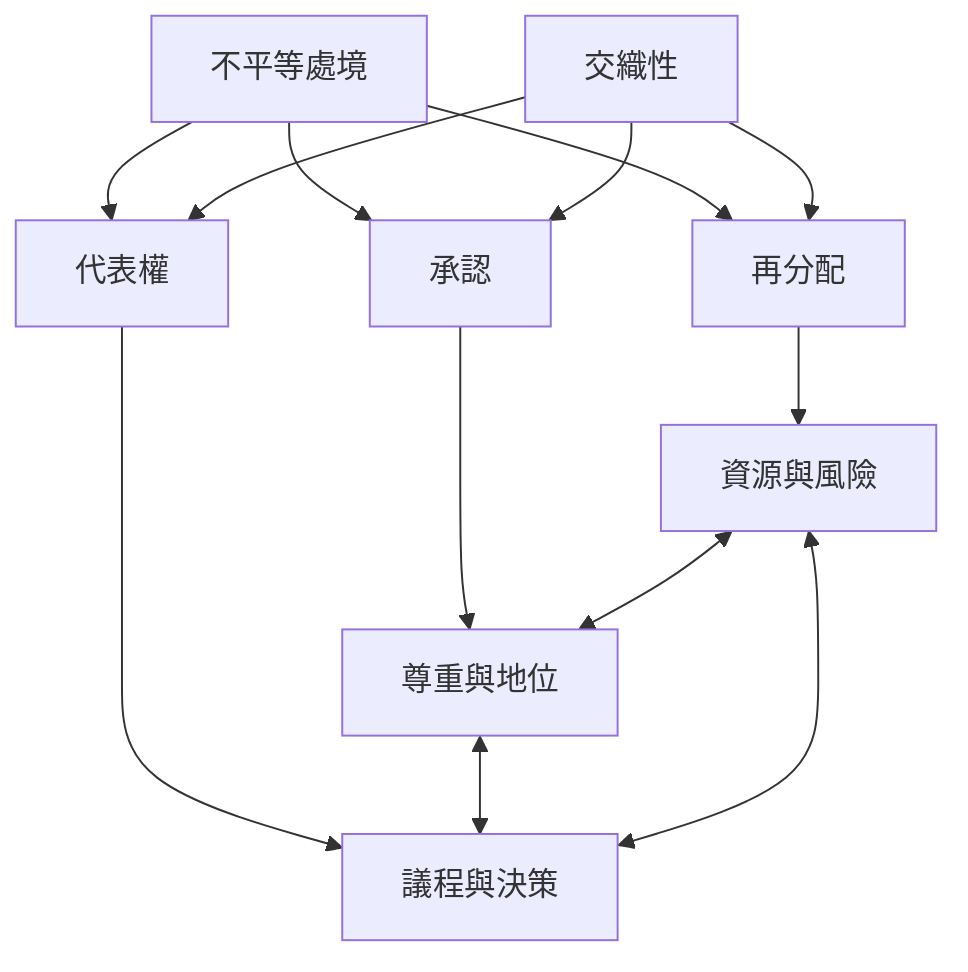

經濟資源、文化地位與政治發言權並非彼此獨立。交織性提醒我們，群體內部處境不同，政策分類必須檢查多重權力如何共同運作。這張圖可作為社會問題研究的提問清單。

## 概念關係圖

```mermaid
flowchart TD
  A[不平等處境] --> B[再分配]
  A --> C[承認]
  A --> D[代表權]
  E[交織性] --> B
  E --> C
  E --> D
  B --> F[資源與風險]
  C --> G[尊重與地位]
  D --> H[議程與決策]
  F <--> G
  G <--> H
  H <--> F
```

## 導覽脈絡
[[交織性]]、[[代表權]]、[[全球平等]]、[[再分配]]、[[反種姓運動]]、[[性別平等]]、[[承認]]、[[交織性分析揭露單一分類政策的盲點]]、[[再分配承認與代表權必須一起處理]]
