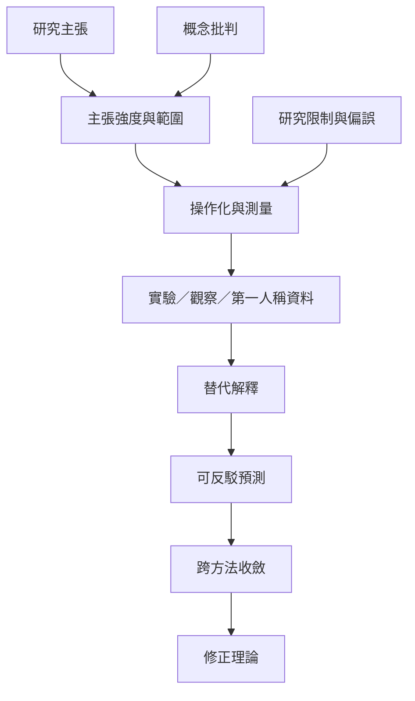

具身認知是一組理論主張，研究必須明確指出機制、範圍與可反駁預測。相關性、主觀經驗與理論框架需要互相補充而非互相取代。

```mermaid
flowchart TD
  A[研究主張] --> B[主張強度與範圍]
  B --> C[操作化與測量]
  C --> D[實驗／觀察／第一人稱資料]
  D --> E[替代解釋]
  E --> F[可反駁預測]
  F --> G[跨方法收斂]
  H[概念批判] --> B
  I[研究限制與偏誤] --> C
  G --> J[修正理論]
```

## 概念連結
[[具身認知]]、[[具身認知的主張需要區分強弱]]、[[理論必須提出可反駁的具體預測]]、[[相關性不能直接推導出機制]]、[[主觀覺察與客觀準確度需要分開測量]]。
