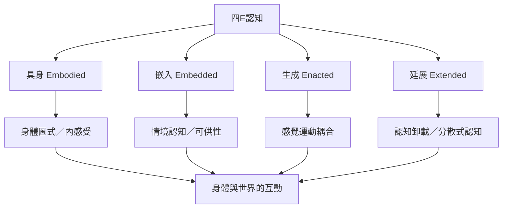

四E認知提供四個不同入口，分析認知如何依賴身體、情境、生成性行動與外部資源。分類有助於辨認理論差異，不代表每個研究都必須同時符合四個 E。

```mermaid
flowchart TD
  A[四E認知] --> B[具身 Embodied]
  A --> C[嵌入 Embedded]
  A --> D[生成 Enacted]
  A --> E[延展 Extended]
  B --> F[身體圖式／內感受]
  C --> G[情境認知／可供性]
  D --> H[感覺運動耦合]
  E --> I[認知卸載／分散式認知]
  F --> J[身體與世界的互動]
  G --> J
  H --> J
  I --> J
```

## 概念連結
[[四E認知]]、[[具身認知]]、[[生成認知]]、[[嵌入認知]]、[[延展心智]]、[[身體圖式]]、[[內感受]]、[[可供性]]、[[感覺運動耦合]]、[[認知卸載]]、[[分散式認知]]。
