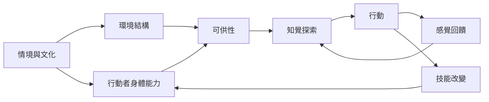

生態與生成取向將知覺、行動與環境理解為持續迴圈。行動者的身體能力與環境特徵共同決定可供性；探索又改變能取得的資訊。

```mermaid
flowchart LR
  A[行動者身體能力] --> C[可供性]
  B[環境結構] --> C
  C --> D[知覺探索]
  D --> E[行動]
  E --> F[感覺回饋]
  F --> D
  E --> G[技能改變]
  G --> A
  H[情境與文化] --> B
  H --> A
```

## 概念連結
[[生態心理學]]、[[可供性]]、[[感覺運動耦合]]、[[生成認知]]、[[具身認知]]、[[文化實踐]]、[[可供性]]。
