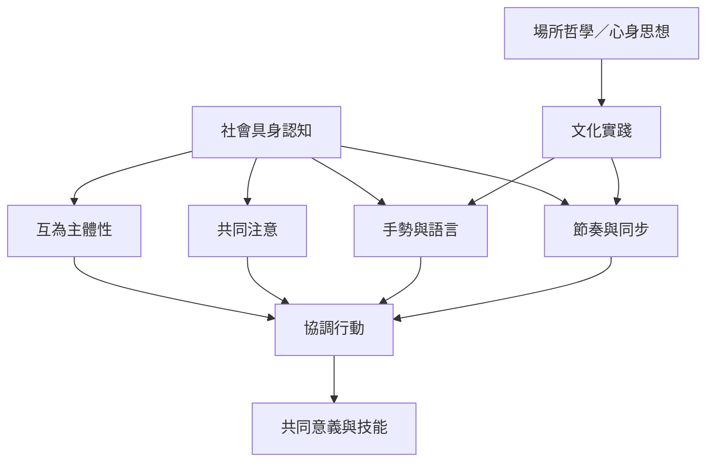

認知在人際互動與文化實踐中形成。共同注意、姿勢、節奏、手勢與語言讓參與者相互校準；不同哲學傳統可提出對照問題，但不可抹除歷史脈絡差異。

```mermaid
flowchart TD
  A[社會具身認知] --> B[互為主體性]
  A --> C[共同注意]
  A --> D[手勢與語言]
  A --> E[節奏與同步]
  B --> F[協調行動]
  C --> F
  D --> F
  E --> F
  G[文化實踐] --> D
  G --> E
  H[場所哲學／心身思想] --> G
  F --> I[共同意義與技能]
```

## 概念連結
[[互為主體性]]、[[共同注意]]、[[手勢]]、[[具身語言]]、[[文化實踐]]、[[場所哲學]]、[[生成認知]]、[[具身學習]]。
