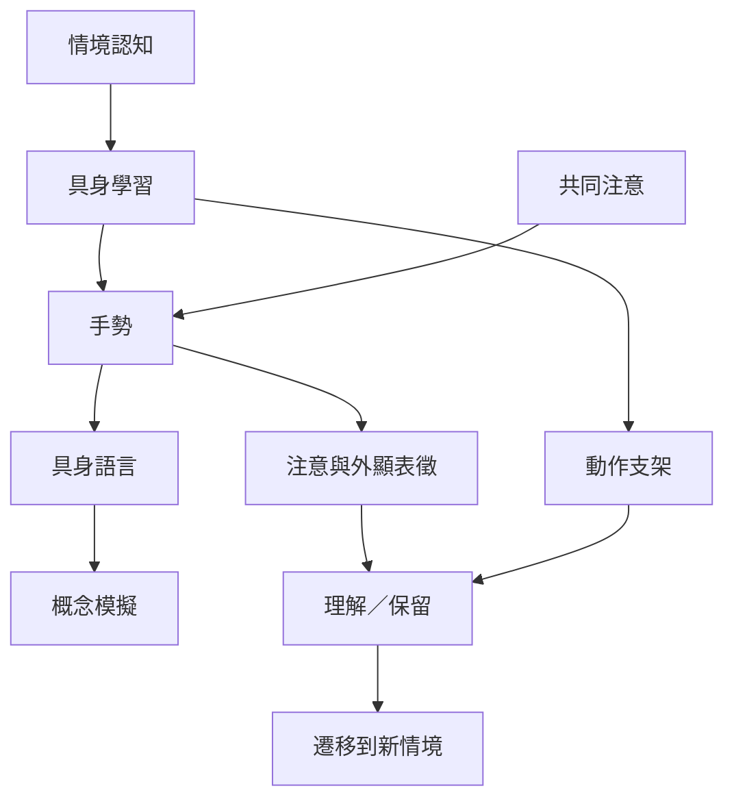

語言、手勢與學習並非互斥管道。手勢能補充語句、揭露尚未穩定的理解，也可能支援抽象化；但教學成效仍須看任務、學生與遷移結果。

```mermaid
flowchart TD
  A[具身學習] --> B[手勢]
  A --> C[動作支架]
  B --> D[注意與外顯表徵]
  B --> E[具身語言]
  E --> F[概念模擬]
  D --> G[理解／保留]
  C --> G
  G --> H[遷移到新情境]
  I[情境認知] --> A
  J[共同注意] --> B
```

## 概念連結
[[具身學習]]、[[手勢]]、[[動作支架]]、[[具身語言]]、[[概念模擬]]、[[情境認知]]、[[共同注意]]。
