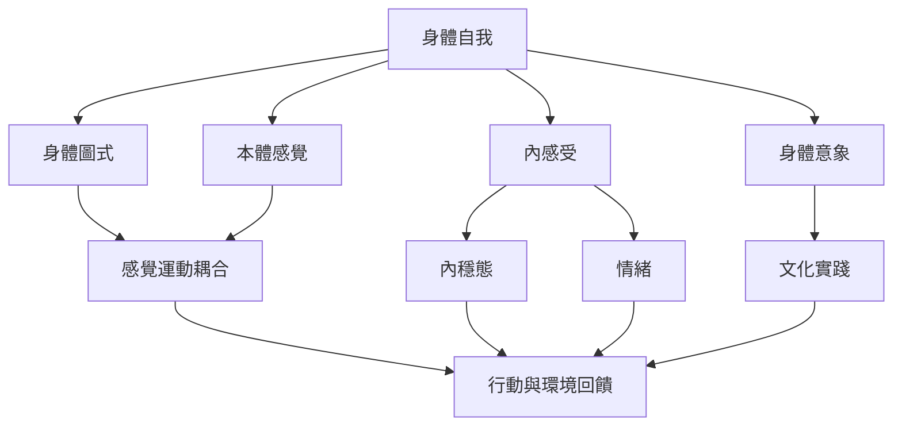

身體自我不是單一感官或一個固定表徵，而是多種感覺、動作調節、主觀信念與環境互動的動態整合。此圖把身體圖式、身體意象、內感受與本體感覺放在同一網絡中。

```mermaid
flowchart TD
  A[身體自我] --> B[身體圖式]
  A --> C[身體意象]
  A --> D[內感受]
  A --> E[本體感覺]
  B --> F[感覺運動耦合]
  E --> F
  D --> G[內穩態]
  D --> H[情緒]
  C --> I[文化實踐]
  F --> J[行動與環境回饋]
  G --> J
  H --> J
  I --> J
```

## 概念連結
[[身體自我]]、[[身體圖式]]、[[身體意象]]、[[內感受]]、[[本體感覺]]、[[感覺運動耦合]]、[[內穩態]]、[[情緒經驗包含對身體訊號的詮釋]]、[[文化實踐]]。
