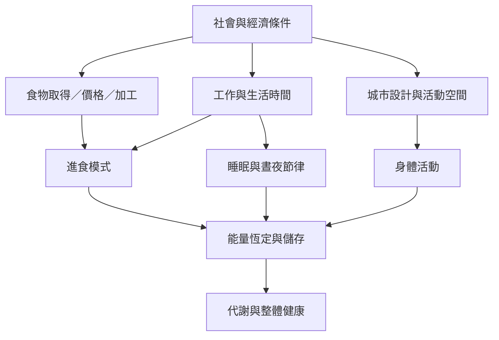

能量恆定的生理機制存在於個體內，但長期輸入由社會環境塑造。食品加工、價格、行銷、工作型態、光照、交通與安全活動空間，都可能改變進食和活動方式。

```mermaid
flowchart TD
  SOC[社會與經濟條件] --> FOOD[食物取得／價格／加工]
  SOC --> TIME[工作與生活時間]
  SOC --> PLACE[城市設計與活動空間]
  FOOD --> IN[進食模式]
  TIME --> SLEEP[睡眠與晝夜節律]
  TIME --> IN
  PLACE --> PA[身體活動]
  IN --> HOME[能量恆定與儲存]
  SLEEP --> HOME
  PA --> HOME
  HOME --> HEALTH[代謝與整體健康]
```

從[[肥胖的全球分布反映生物易感性與食物環境交互作用]]出發，連結[[食物環境會改變身體調節系統面對的日常輸入]]、[[共食與續食可以成為支持能量健康的社區基礎設施]]與[[公共健康介入應同時降低營養不足與致肥環境造成的風險]]。
