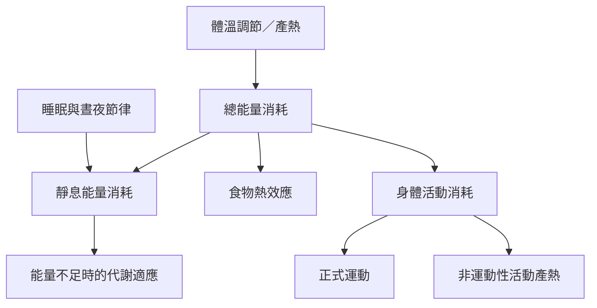

總能量消耗可拆成靜息能量消耗、食物熱效應與身體活動相關消耗。這些部分會隨身體大小、組成、飲食、睡眠、訓練、疾病與能量可用性改變；因此公式是概念架構，不是固定比例。

```mermaid
flowchart TD
  TEE[總能量消耗] --> RMR[靜息能量消耗]
  TEE --> TEF[食物熱效應]
  TEE --> PA[身體活動消耗]
  PA --> EX[正式運動]
  PA --> NEAT[非運動性活動產熱]
  RMR --> ADAPT[能量不足時的代謝適應]
  TEMP[體溫調節／產熱] --> TEE
  SLEEP[睡眠與晝夜節律] --> RMR
```

相關筆記：[[能量測量方法決定研究能回答什麼]]、[[減重後的代謝適應是真實反應但幅度與持續性依研究而異]]、[[身體活動與總能量消耗的關係仍存在加成與補償模型之爭]]、[[棕色脂肪參與產熱但不宜視為簡單減重捷徑]]。
