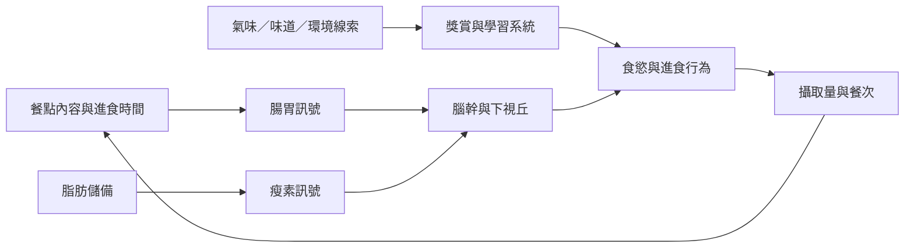

進食不只是由胃部空虛或意志決定，而是腸胃荷爾蒙、脂肪儲備訊號、腦內神經網絡、食物感官與社會情境共同作用的結果。

```mermaid
flowchart LR
  MEAL[餐點內容與進食時間] --> GUT[腸胃訊號]
  GUT --> BRAIN[腦幹與下視丘]
  FAT[脂肪儲備] --> LEP[瘦素訊號]
  LEP --> BRAIN
  CUE[氣味／味道／環境線索] --> REWARD[獎賞與學習系統]
  REWARD --> APP[食慾與進食行為]
  BRAIN --> APP
  APP --> INTAKE[攝取量與餐次]
  INTAKE --> MEAL
```

由[[食慾]]、[[飢餓素]]、[[腸胃荷爾蒙]]、[[瘦素]]與[[腸腦軸]]等概念筆記展開；再搭配[[超加工飲食會改變自發進食量]]與[[改善日常食物環境比反覆要求自己抵抗誘惑更可持續]]。
