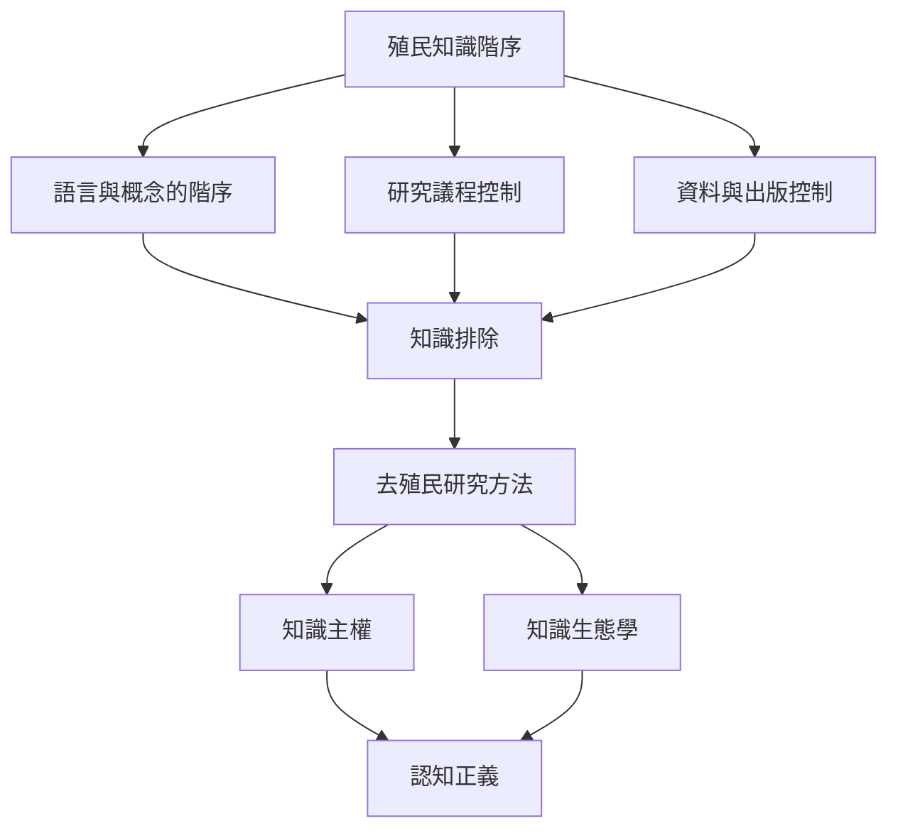

殖民歷史會形塑何者能成為理論、何者被當成資料，以及哪些語言與方法被視為正統。全球南方與原住民族研究主張，修復需要改變知識生產制度與治理權，而非僅把被排除的案例添加到既有知識架構。

```mermaid
flowchart TD
 A[殖民知識階序] --> B[語言與概念的階序]
 A --> C[研究議程控制]
 A --> D[資料與出版控制]
 B --> E[知識排除]
 C --> E
 D --> E
 E --> F[去殖民研究方法]
 F --> G[知識主權]
 F --> H[知識生態學]
 G --> I[認知正義]
 H --> I
```

概念連結：[[認知正義]]、[[知識主權]]、[[去殖民研究方法]]、[[知識生態學]]、[[知識多元]]、[[立場認識論]]。
