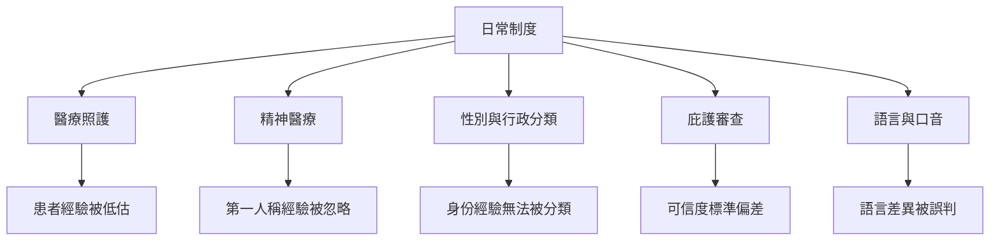

認識不正義並非抽象學術爭論。醫療中的患者證言、精神醫療中的經驗詮釋、性別分類、難民可信度審查與口音歧視，都顯示制度如何決定誰被相信、誰能命名自身經驗，以及誰能被納入服務。

```mermaid
flowchart TD
 A[日常制度] --> B[醫療照護]
 A --> C[精神醫療]
 A --> D[性別與行政分類]
 A --> E[庇護審查]
 A --> F[語言與口音]
 B --> G[患者經驗被低估]
 C --> H[第一人稱經驗被忽略]
 D --> I[身份經驗無法被分類]
 E --> J[可信度標準偏差]
 F --> K[語言差異被誤判]
```

概念連結：[[患者經驗]]、[[現象學證言]]、[[證言不正義]]、[[詮釋不正義]]、[[口音歧視]]、[[可信度赤字]]。
