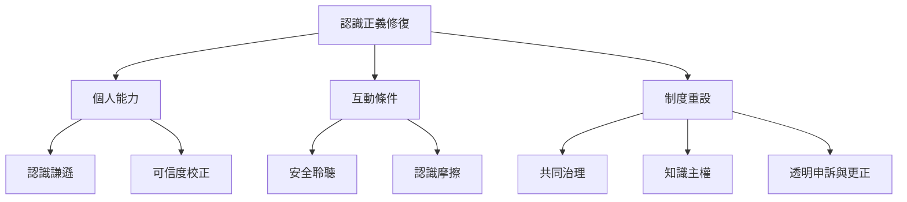

修復不正義不能只要求個別聽者變得友善，也需要重設溝通、研究與決策制度，讓異議、回饋、共同治理和知識主權成為可持續的實踐。

```mermaid
flowchart TD
 A[認識正義修復] --> B[個人能力]
 A --> C[互動條件]
 A --> D[制度重設]
 B --> E[認識謙遜]
 B --> F[可信度校正]
 C --> G[安全聆聽]
 C --> H[認識摩擦]
 D --> I[共同治理]
 D --> J[知識主權]
 D --> K[透明申訴與更正]
```

概念連結：[[認識摩擦]]、[[認識謙遜]]、[[知識主權]]、[[研究倫理]]、[[知識生產]]、[[知識多元]]。
