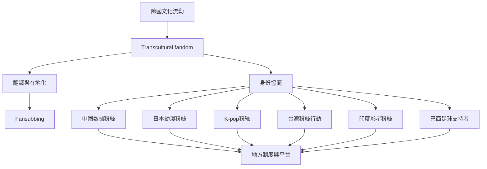

粉絲文化跨境流動時，會經過翻譯、在地化、產業平台與政治文化邊界。跨國連結不會消除差異，反而使地方身份、語言和解讀更需要被理解。

```mermaid
flowchart TD
  G[跨國文化流動] --> T[Transcultural fandom]
  T --> TR[翻譯與在地化]
  TR --> FS[Fansubbing]
  T --> ID[身份協商]
  ID --> CN[中國數據粉絲]
  ID --> JP[日本動漫粉絲]
  ID --> KR[K-pop粉絲]
  ID --> TW[台灣粉絲行動]
  ID --> IN[印度影星粉絲]
  ID --> BR[巴西足球支持者]
  CN --> C[地方制度與平台]
  JP --> C
  KR --> C
  TW --> C
  IN --> C
  BR --> C
```

此圖連結 [[跨文化粉絲活動不是簡單文化輸入而是翻譯協商]]、[[比較不同地區粉絲文化時先建立在地脈絡再尋找共通機制]]。

## 參考
* [[Transcultural fandom]]、[[Fansubbing]]、[[Fandom]]。
