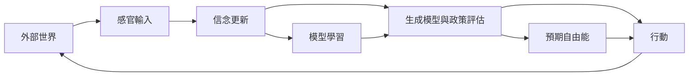

此圖把推論、學習與政策選擇放在閉環中：行動改變感官資料，感官資料更新信念，經驗又可能改變生成模型。預期自由能常被用於比較未來政策，並同時納入偏好與資訊價值。

## 關係圖

```mermaid
flowchart LR
    W[外部世界] --> O[感官輸入]
    O --> Q[信念更新]
    Q --> G[生成模型與政策評估]
    G --> A[行動]
    A --> W
    G --> F[預期自由能]
    F --> A
    Q --> L[模型學習]
    L --> G
```

## 概念連結
* [[主動推論]]
* [[生成模型]]
* [[預期自由能]]
* [[認識性價值]]
* [[工具性價值]]
* [[政策]]
* [[行動能藉由改變感官輸入來實現預測]]
