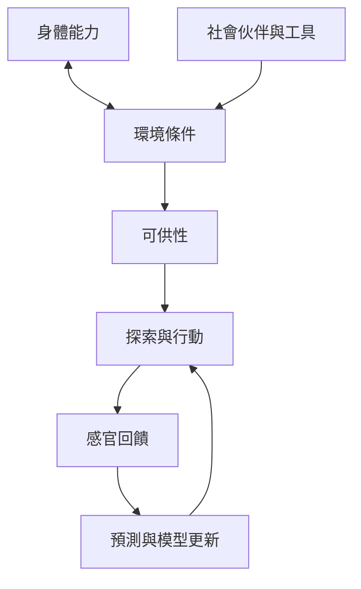

自由能與主動推論的具身詮釋，應將大腦放回身體、任務與環境之中。生態心理學和可供性概念讓我們能問：行動者如何主動探索環境，並在實際互動中形成技能？

## 關係圖

```mermaid
flowchart TD
    B[身體能力] <--> E[環境條件]
    E --> A[可供性]
    A --> X[探索與行動]
    X --> S[感官回饋]
    S --> M[預測與模型更新]
    M --> X
    C[社會伙伴與工具] --> E
```

## 概念連結
* [[具身認知]]
* [[生態心理學]]
* [[可供性]]
* [[預測處理]]
* [[內感受]]
* [[主動推論]]
* [[生態心理學提醒心智與環境共同構成技能]]
