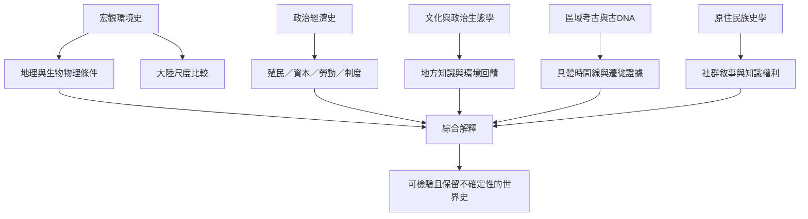

宏觀環境模型應與政治經濟、文化生態、原住民族史學和區域考古互相校正。

```mermaid
flowchart TD
A[宏觀環境史] --> B[地理與生物物理條件]
A --> C[大陸尺度比較]
D[政治經濟史] --> E[殖民／資本／勞動／制度]
F[文化與政治生態學] --> G[地方知識與環境回饋]
H[區域考古與古DNA] --> I[具體時間線與遷徙證據]
J[原住民族史學] --> K[社群敘事與知識權利]
B --> L[綜合解釋]
E --> L
G --> L
I --> L
K --> L
L --> M[可檢驗且保留不確定性的世界史]
```

概念與案例：[[環境決定論]]、[[政治生態學]]、[[大分流]]、[[古DNA]]、[[原住民族知識治理]]、[[環境決定論批判指出自然環境敘事可能重製歐洲中心論]]、[[歷史學者批評宏觀尺度壓縮了資本主義帝國與權力關係]]、[[跨學科總論應被當作研究地圖而不是最後答案]]
