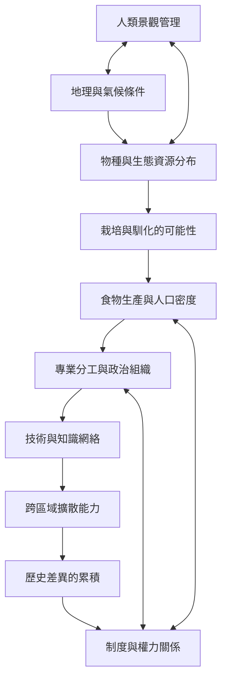

此圖把本書的環境解釋拆成物種資源、農業、人口密度與擴散，同時加入制度和人類環境回饋，避免把地理當作唯一原因。

```mermaid
flowchart TD
A[地理與氣候條件] --> B[物種與生態資源分布]
B --> C[栽培與馴化的可能性]
C --> D[食物生產與人口密度]
D --> E[專業分工與政治組織]
E --> F[技術與知識網絡]
F --> G[跨區域擴散能力]
H[制度與權力關係] <--> D
H <--> E
I[人類景觀管理] <--> A
I <--> B
G --> J[歷史差異的累積]
J --> H
```

概念與案例：[[生物地理學]]、[[環境可能論]]、[[環境決定論]]、[[環境提供可能性與限制但不會單獨決定歷史]]、[[可馴化物種的分布改變農業起步的選項集合]]、[[大陸軸線影響擴散速度但不是文化傳播的唯一條件]]、[[人類與環境共同塑造歷史景觀]]
