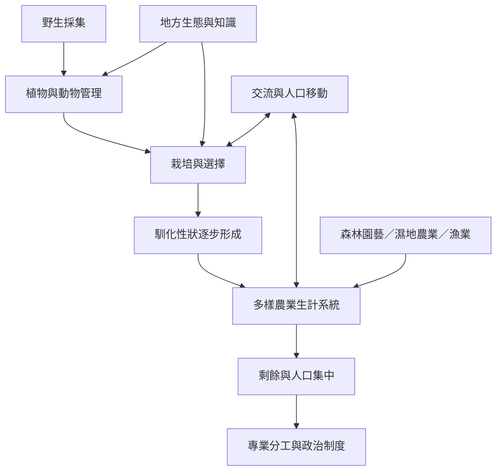

農業起源不是單一革命，而是採集、管理、栽培、馴化和社會生計轉型逐步交疊的多地區過程。

```mermaid
flowchart TD
A[野生採集] --> B[植物與動物管理]
B --> C[栽培與選擇]
C --> D[馴化性狀逐步形成]
D --> E[多樣農業生計系統]
E --> F[剩餘與人口集中]
F --> G[專業分工與政治制度]
H[地方生態與知識] --> B
H --> C
I[交流與人口移動] <--> C
I <--> E
J[森林園藝／濕地農業／漁業] --> E
```

概念與案例：[[農業馴化]]、[[生計轉型]]、[[農業剩餘能支撐人口集中但不必然產生平等或進步]]、[[農業起源應由多地區多路徑與長期景觀互動理解]]、[[新幾內亞庫克沼澤提供獨立農業發展考古證據]]、[[東亞稻作與粟作呈現多區域且非同步的農業發展]]、[[瑪雅低地農業不能簡化為單一玉米輪耕模式]]
