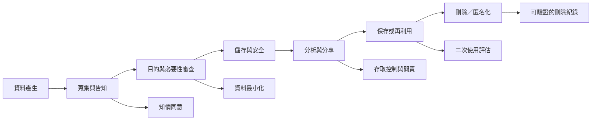

隱私治理不是只在資料外洩後啟動，而是沿著資訊生命週期持續決策：每一次蒐集、轉用、分享、保存與刪除，都需要明確目的、必要性、權限、期限和補救方法。

```mermaid
flowchart LR
  A[資料產生] --> B[蒐集與告知]
  B --> C[目的與必要性審查]
  C --> D[儲存與安全]
  D --> E[分析與分享]
  E --> F[保存或再利用]
  F --> G[刪除／匿名化]
  C --> H[資料最小化]
  B --> I[知情同意]
  E --> J[存取控制與問責]
  F --> K[二次使用評估]
  G --> L[可驗證的刪除紀錄]
```

概念連結：[[資訊生命週期]]、[[資訊隱私]]、[[個人資料保護]]、[[資料最小化]]、[[目的限制]]、[[研究倫理]]。

延伸閱讀：[[資訊倫理必須同時分析個人制度與社會結構]]、[[資訊生命週期的每一階段都會產生不同倫理責任]]。
