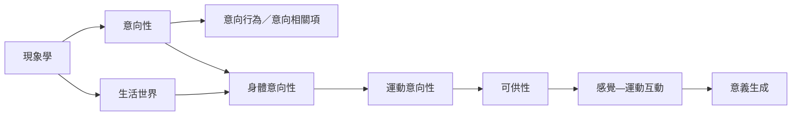

這張地圖把經驗的對象指向性放回身體、情境與行動。胡塞爾分析經驗如何呈現對象；梅洛龐蒂強調身體技能的前反思理解；可供性與生成論則把環境理解為行動可能性的場域。

```mermaid
flowchart LR
  A[現象學] --> B[意向性]
  B --> C[意向行為／意向相關項]
  B --> D[身體意向性]
  D --> E[運動意向性]
  E --> F[可供性]
  F --> G[感覺—運動互動]
  G --> H[意義生成]
  A --> I[生活世界]
  I --> D
```

概念交會：[[現象學]]、[[現象學懸擱]]、[[生活世界]]、[[意向性]]、[[意向行為]]、[[noesis]]、[[noema]]、[[運動意向性]]、[[可供性]]、[[生成論認知]]、[[意義生成]]
