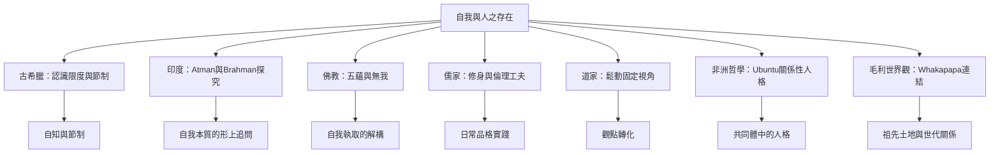

不同思想傳統不只提供不同的自我認識方法，也在回答不同問題：自我是否有本質？是否由關係構成？是否透過修身形成？是否應被視為五蘊流變？比較時應保留各傳統內部差異與歷史語境。

```mermaid
flowchart TD
  A[自我與人之存在] --> B[古希臘：認識限度與節制]
  A --> C[印度：Atman與Brahman探究]
  A --> D[佛教：五蘊與無我]
  A --> E[儒家：修身與倫理工夫]
  A --> F[道家：鬆動固定視角]
  A --> G[非洲哲學：Ubuntu關係性人格]
  A --> H[毛利世界觀：Whakapapa連結]
  B --> I[自知與節制]
  C --> J[自我本質的形上追問]
  D --> K[自我執取的解構]
  E --> L[日常品格實踐]
  F --> M[觀點轉化]
  G --> N[共同體中的人格]
  H --> O[祖先土地與世代關係]
```

連結：[[Atman]]、[[Brahman]]、[[無我]]、[[五蘊]]、[[修身]]、[[Ubuntu]]、[[Whakapapa]]、[[觀點取替]]。

本書導讀：[[Know_thyself]]。
