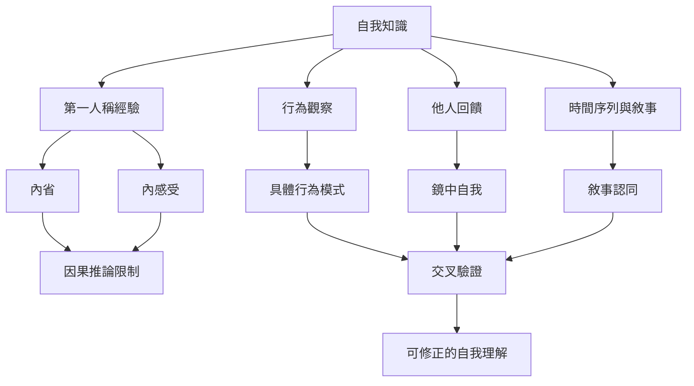

這張地圖聚焦「我如何知道自己的心智」：第一人稱經驗有其特殊位置，但內省的範圍有限；行為、他人回饋、元認知與時間序列可以提供補充。最重要的不是選一種唯一正確的方法，而是依問題選擇證據。

```mermaid
flowchart TD
  A[自我知識] --> B[第一人稱經驗]
  A --> C[行為觀察]
  A --> D[他人回饋]
  A --> E[時間序列與敘事]
  B --> F[內省]
  B --> G[內感受]
  C --> H[具體行為模式]
  D --> I[鏡中自我]
  E --> J[敘事認同]
  F --> K[因果推論限制]
  G --> K
  H --> L[交叉驗證]
  I --> L
  J --> L
  L --> M[可修正的自我理解]
```

沿著 [[自我知識]]、[[內省]]、[[元認知]]、[[內感受]] 與 [[敘事認同]] 閱讀，再回到 [[認識自己是一種持續校正而不是一次性發現]]。

本書導讀：[[Know_thyself]]。
