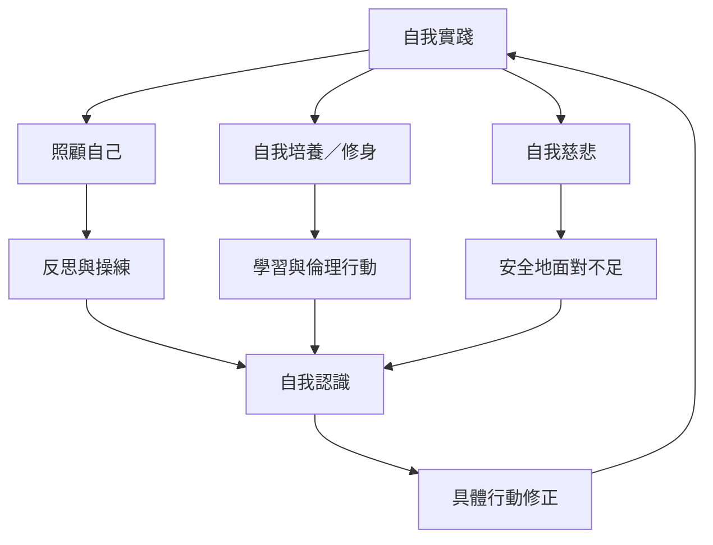

自我知識不是純粹的描述任務，也涉及如何對待自己、他人與世界。儒家修身、古典照顧自己與自我慈悲提供不同實踐路徑；倫理行動則檢驗自我敘述是否落地。

```mermaid
flowchart TD
  A[自我實踐] --> B[照顧自己]
  A --> C[自我培養／修身]
  A --> D[自我慈悲]
  B --> E[反思與操練]
  C --> F[學習與倫理行動]
  D --> G[安全地面對不足]
  E --> H[自我認識]
  F --> H
  G --> H
  H --> I[具體行動修正]
  I --> A
```

連結：[[照顧自己]]、[[自我培養]]、[[修身]]、[[自我慈悲]]、[[認識自己須以倫理行動檢驗而非內在感覺]]。

本書導讀：[[Know_thyself]]。
