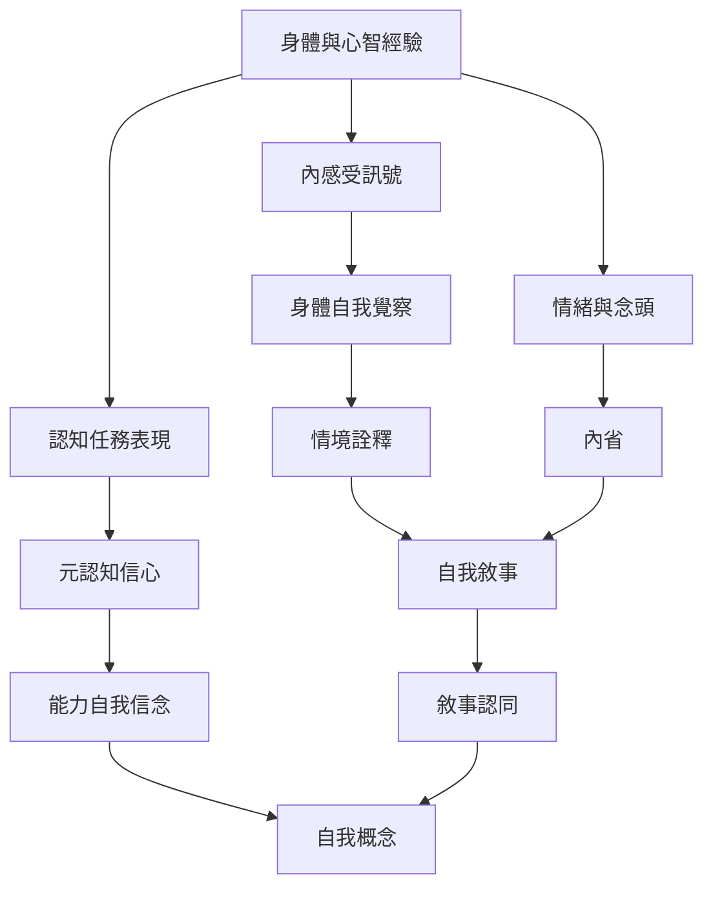

身體感受、情緒辨識、認知信心與生命故事是不同層次。身體訊號會影響自我覺察，但對訊號的詮釋仍需要情境；元認知提供局部認知表現的估計，敘事認同則把經驗放進時間脈絡。

```mermaid
flowchart TD
  A[身體與心智經驗] --> B[內感受訊號]
  B --> C[身體自我覺察]
  C --> D[情境詮釋]
  A --> E[情緒與念頭]
  E --> F[內省]
  A --> G[認知任務表現]
  G --> H[元認知信心]
  D --> I[自我敘事]
  F --> I
  H --> J[能力自我信念]
  I --> K[敘事認同]
  J --> L[自我概念]
  K --> L
```

連結：[[內感受]]、[[元認知]]、[[敘事認同]]、[[自我概念]]、[[身體訊號是線索不是命令或真理]]。

本書導讀：[[Know_thyself]]。
