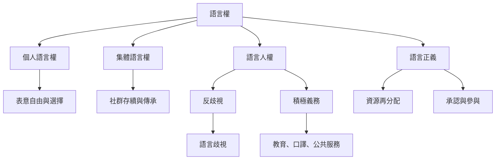

語言權由個人自由、群體存續、反歧視與制度支持構成。閱讀時可先理解權利主體，再觀察國家義務如何回應歷史權力差距。

```mermaid
flowchart TD
    A[語言權] --> B[個人語言權]
    A --> C[集體語言權]
    A --> D[語言人權]
    A --> E[語言正義]
    B --> F[表意自由與選擇]
    C --> G[社群存續與傳承]
    D --> H[反歧視]
    D --> I[積極義務]
    E --> J[資源再分配]
    E --> K[承認與參與]
    H --> L[語言歧視]
    I --> M[教育、口譯、公共服務]
```

可先讀[[語言權同時包含免受歧視的自由與支持語言使用的積極義務]]、[[語言權具有個人與集體兩個互補層次]]、[[語言平等不代表忽略歷史造成的資源差距]]，再比較[[官方語言地位不等於所有語言享有同樣制度保障]]。
