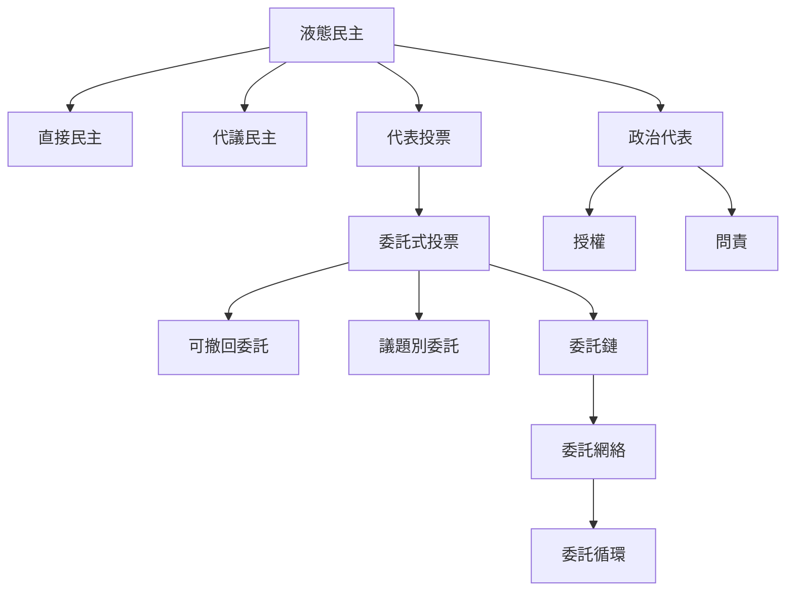

液態民主的核心在於讓參與者能在直接投票與委託代表之間轉換。制度細節包括委託範圍、可撤回性、轉委託鏈與計票規則；這些機制會連動代表問責與權力分布。

```mermaid
flowchart TD
    A[液態民主] --> B[直接民主]
    A --> C[代議民主]
    A --> D[代表投票]
    D --> E[委託式投票]
    E --> F[可撤回委託]
    E --> G[議題別委託]
    E --> H[委託鏈]
    H --> I[委託網絡]
    I --> J[委託循環]
    A --> K[政治代表]
    K --> L[授權]
    K --> M[問責]
```

## 參考
* [[液態民主]]、[[代表投票]]、[[委託式投票]]、[[可撤回委託]]、[[議題別委託]]、[[委託鏈]]、[[委託循環]]、[[委託網絡]]、[[直接民主]]、[[代議民主]]、[[政治代表]]。
