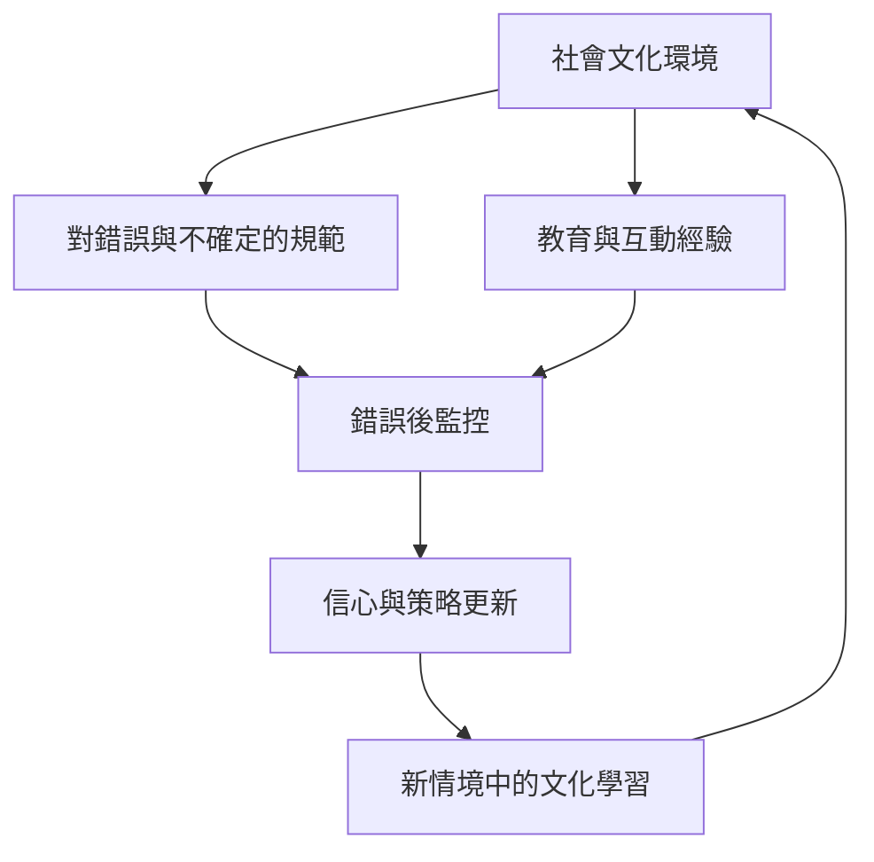

文化研究提醒：監控與信心不是完全脫離社會的私人能力。日常規範、錯誤回饋、教育方式與他人建議，可能塑造人如何表達不確定、辨認錯誤與修正判斷。

## Mermaid 關係圖

```mermaid
flowchart TD
    A[社會文化環境] --> B[對錯誤與不確定的規範]
    A --> C[教育與互動經驗]
    B --> D[錯誤後監控]
    C --> D
    D --> E[信心與策略更新]
    E --> F[新情境中的文化學習]
    F --> A

```

## 延伸閱讀
[[後設認知能力會在社會互動與文化實踐中形成]]、[[跨文化研究必須區分任務能力與信心偏誤]]、[[錯誤是啟動後設監控的重要訊號]]、[[情緒與社會經驗也需要後設認知而非只有解題]]
