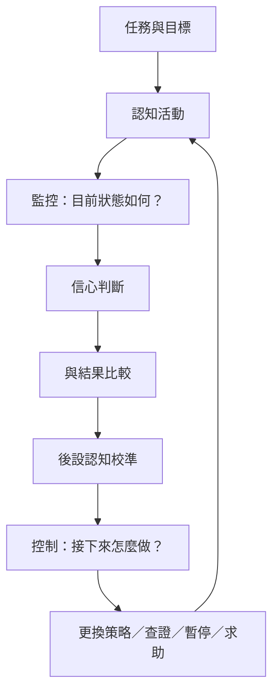

監控輸出的是對狀態的估計，不是狀態本身。信心必須與實際表現對照，才能知道監控是否校準；控制再依據監控結果採取查證、重試、求助或策略轉換。

## Mermaid 關係圖

```mermaid
flowchart TD
    A[任務與目標] --> B[認知活動]
    B --> C[監控：目前狀態如何？]
    C --> D[信心判斷]
    D --> E[與結果比較]
    E --> F[後設認知校準]
    F --> G[控制：接下來怎麼做？]
    G --> H[更換策略／查證／暫停／求助]
    H --> B

```

## 延伸閱讀
[[後設認知監控]]、[[後設認知控制]]、[[信心判斷]]、[[後設認知校準]]、[[不確定性]]、[[後設認知能協助人決定何時相信與何時暫停]]、[[錯誤是啟動後設監控的重要訊號]]
