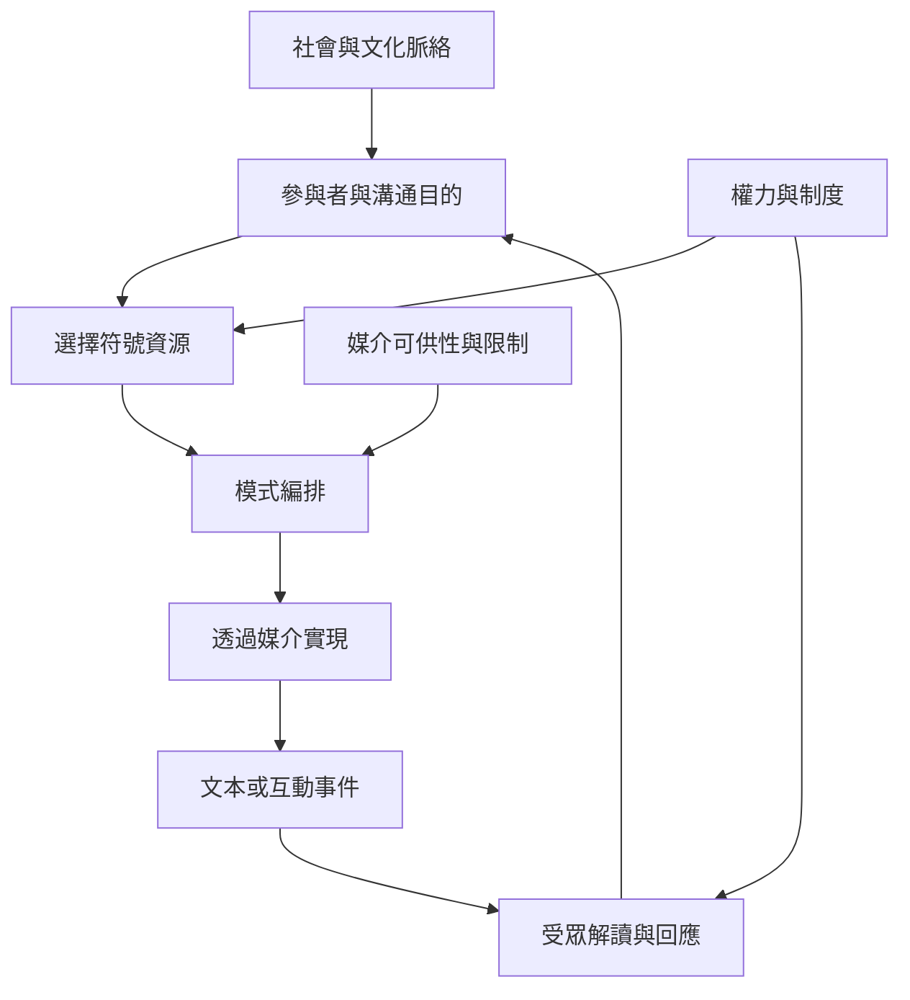

多模態意義生成不是媒體堆疊，而是參與者在情境中選擇符號資源、利用媒介可供性並編排模式關係的過程。社會規範與權力決定哪些表達容易被理解、被看見或被承認。

```mermaid
flowchart TD
  A[社會與文化脈絡] --> B[參與者與溝通目的]
  B --> C[選擇符號資源]
  C --> D[模式編排]
  D --> E[透過媒介實現]
  E --> F[文本或互動事件]
  F --> G[受眾解讀與回應]
  G --> B
  H[媒介可供性與限制] --> D
  I[權力與制度] --> C
  I --> G
```

這張圖連結[[多模態]]、[[模式]]、[[媒介]]、[[符號資源]]、[[社會符號學]]、[[可供性]]、[[轉譯]]與[[多模態話語分析]]。可以從任一節點開始分析，但必須把作品放回社會情境。
