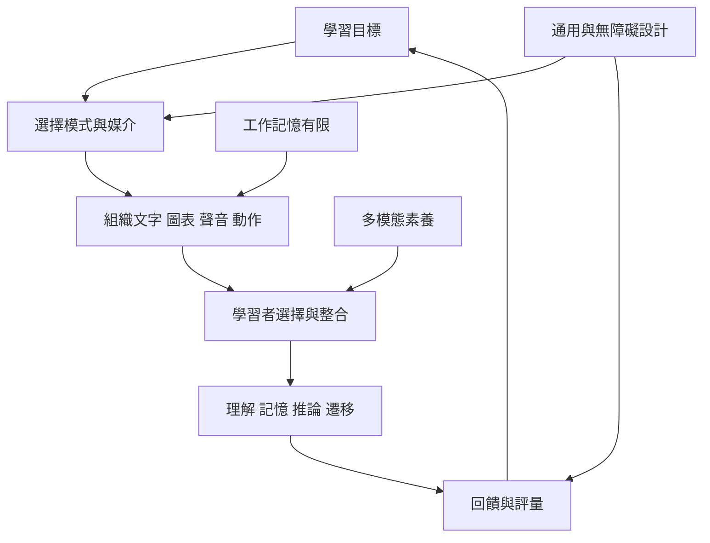

教學設計應從學習目標出發，選擇能互補的模式，降低無關負荷並增加學習者主動組織、表達和回饋的機會。多模態素養包括閱讀媒體與製作意義，不等同於使用更多科技。

```mermaid
flowchart TD
  A[學習目標] --> B[選擇模式與媒介]
  B --> C[組織文字 圖表 聲音 動作]
  C --> D[學習者選擇與整合]
  D --> E[理解 記憶 推論 遷移]
  E --> F[回饋與評量]
  F --> A
  G[工作記憶有限] --> C
  H[多模態素養] --> D
  I[通用與無障礙設計] --> B
  I --> F
```

這張圖連結[[多媒體學習]]、[[認知負荷]]、[[多模態素養]]、[[通用設計]]、[[無障礙設計]]與[[轉譯]]。
