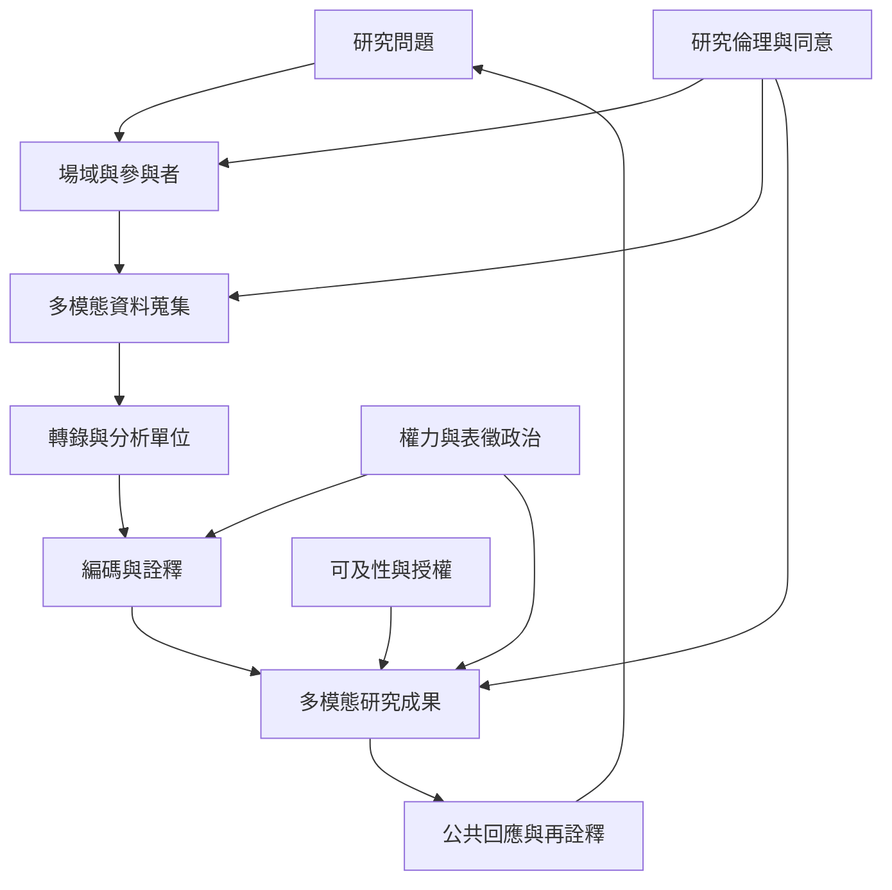

多模態研究必須同時回答如何分析以及誰控制表徵。研究者需要交代資料單位、轉錄與編碼方式，也要處理同意、授權、保存、再利用和社群詮釋權。

```mermaid
flowchart TD
  A[研究問題] --> B[場域與參與者]
  B --> C[多模態資料蒐集]
  C --> D[轉錄與分析單位]
  D --> E[編碼與詮釋]
  E --> F[多模態研究成果]
  F --> G[公共回應與再詮釋]
  G --> A
  H[研究倫理與同意] --> B
  H --> C
  H --> F
  I[權力與表徵政治] --> E
  I --> F
  J[可及性與授權] --> F
```

此圖連結[[多模態民族誌]]、[[多模態話語分析]]、[[多模態互動分析]]、[[多模態素養]]、[[無障礙設計]]與[[社會符號學]]。
