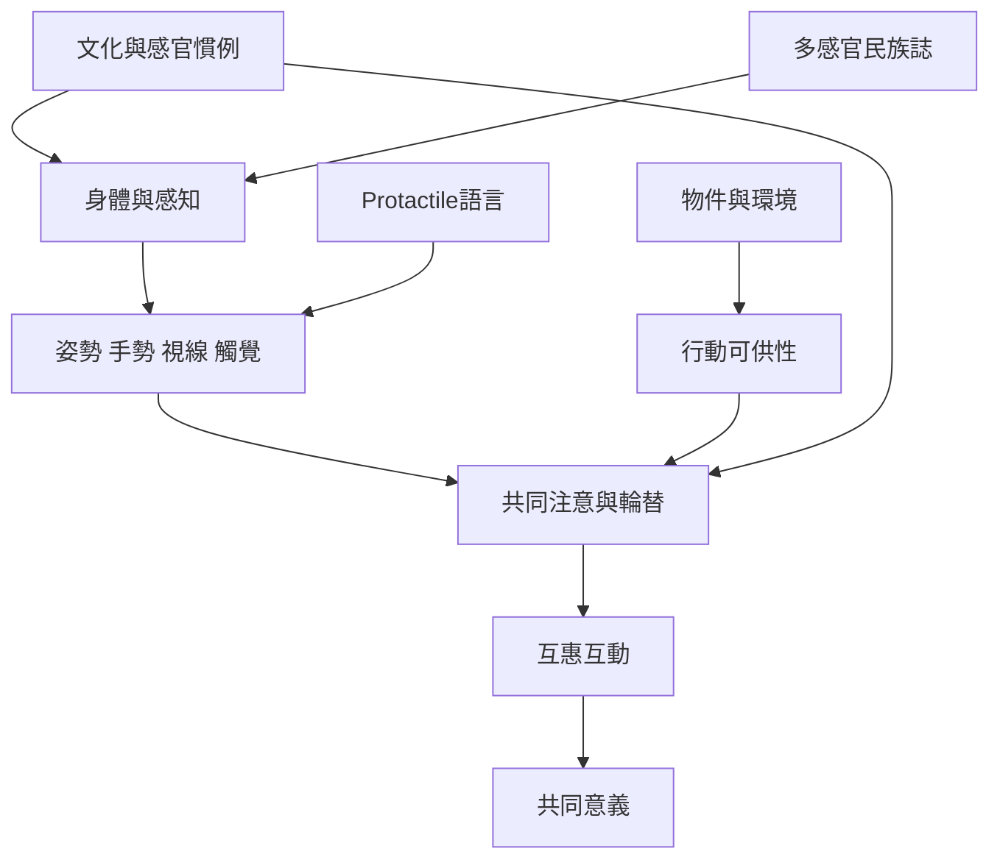

面對面溝通依靠語言以外的身體和物質條件。動作、視線、觸覺、姿勢、物件與環境在時間中協調，讓人們共同注意、回應並完成活動。感官經驗同時受到文化規範塑造。

```mermaid
flowchart TD
  A[身體與感知] --> B[姿勢 手勢 視線 觸覺]
  C[物件與環境] --> D[行動可供性]
  B --> E[共同注意與輪替]
  D --> E
  E --> F[互惠互動]
  F --> G[共同意義]
  H[文化與感官慣例] --> A
  H --> E
  I[多感官民族誌] --> A
  J[Protactile語言] --> B
```

可由[[具身認知]]、[[多模態互動分析]]、[[多感官研究]]、[[感官民族誌]]、[[Protactile語言]]及[[可供性]]進入。
