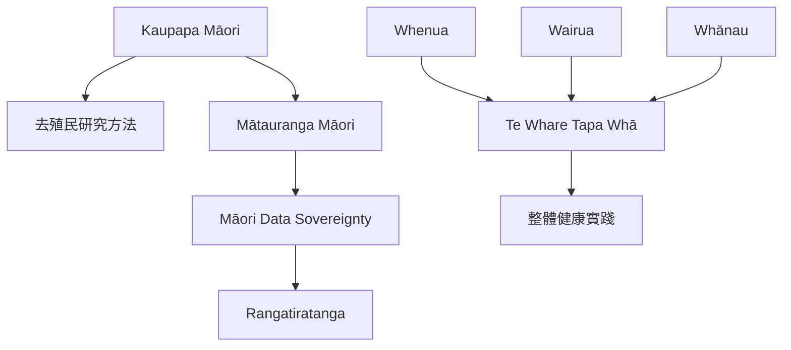

Māori 健康模型與研究主權都提醒：知識、健康與服務的定義不應由外部專業體系單方面決定。研究資料、健康模型與服務設計，都需要納入社群的關係、語言、價值與控制權。

```mermaid
flowchart TD
  KP[Kaupapa Māori] --> DM[去殖民研究方法]
  KP --> MD[Mātauranga Māori]
  MD --> DS[Māori Data Sovereignty]
  DS --> RG[Rangatiratanga]
  WH[Whenua] --> HT[Te Whare Tapa Whā]
  WF[Wairua] --> HT
  FN[Whānau] --> HT
  HT --> HC[整體健康實踐]
```

建議閱讀路徑：[[Kaupapa_Māori]] → [[Māori_data_sovereignty]] → [[Te_Whare_Tapa_Whā]]，並搭配 [[研究倫理必須處理知識控制權而不只是個人同意書]]。
