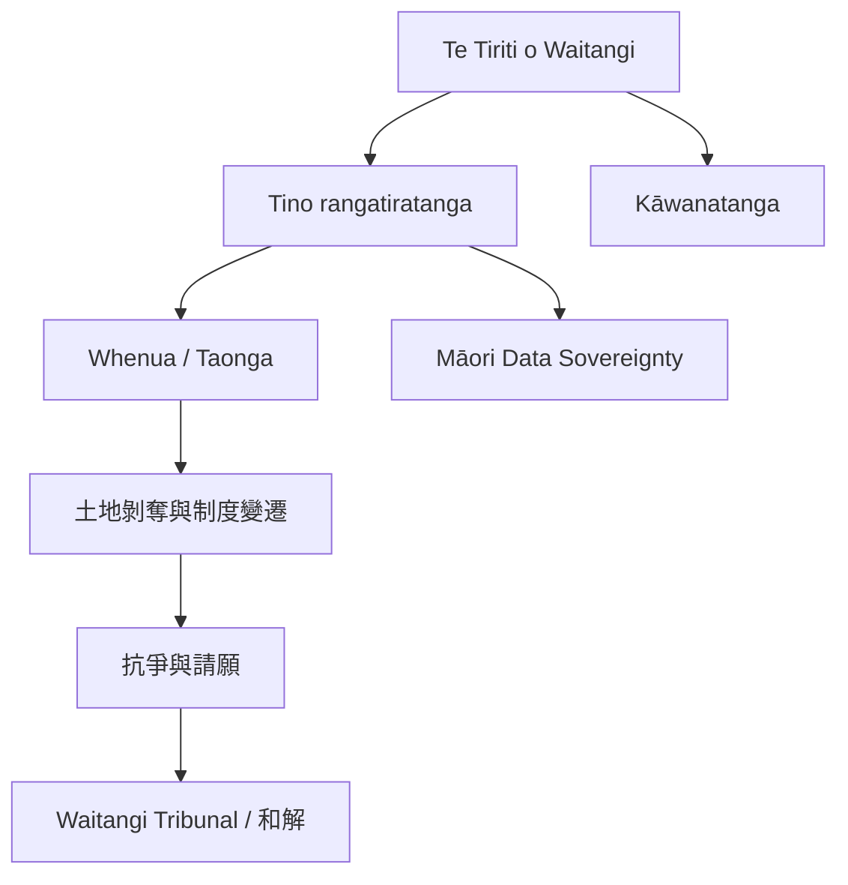

理解現代 Aotearoa Māori 議題，需要同時讀條約文本、土地制度、抗爭歷史與當代自決運動。不要把土地損失、語言衰退與政治排除當成彼此無關的單一事件。

```mermaid
flowchart TD
  TT[Te Tiriti o Waitangi] --> TR[Tino rangatiratanga]
  TT --> KA[Kāwanatanga]
  TR --> WH[Whenua / Taonga]
  WH --> LA[土地剝奪與制度變遷]
  LA --> PR[抗爭與請願]
  PR --> WT[Waitangi Tribunal / 和解]
  TR --> DS[Māori Data Sovereignty]
```

建議閱讀路徑：[[Te_Tiriti_o_Waitangi]] → [[Tino_rangatiratanga]] → [[土地剝奪與原住民主權抗爭是理解近代Māori歷史的必要背景]] → [[Rangatiratanga]]。
