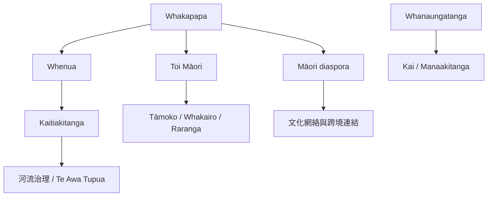

藝術、河流治理、食物實踐與離散社群，看似不同領域，卻共同呈現 Māori 文化如何透過地方、材料、關係與責任持續發展。文化延續不等於形式凍結；跨地域也不等於切斷祖地關係。

```mermaid
flowchart TD
  WP[Whakapapa] --> WM[Whenua]
  WM --> KT[Kaitiakitanga]
  KT --> RV[河流治理 / Te Awa Tupua]
  WP --> TO[Toi Māori]
  TO --> TM[Tāmoko / Whakairo / Raranga]
  WP --> DP[Māori diaspora]
  DP --> CN[文化網絡與跨境連結]
  WH[Whanaungatanga] --> KI[Kai / Manaakitanga]
```

建議閱讀路徑：[[Toi_Māori]] → [[Kaitiakitanga]] → [[Māori_diaspora]] → [[Kai]]，並延伸到 [[河流治理的關鍵不只是賦予自然法律人格而是重構決策關係]]。
