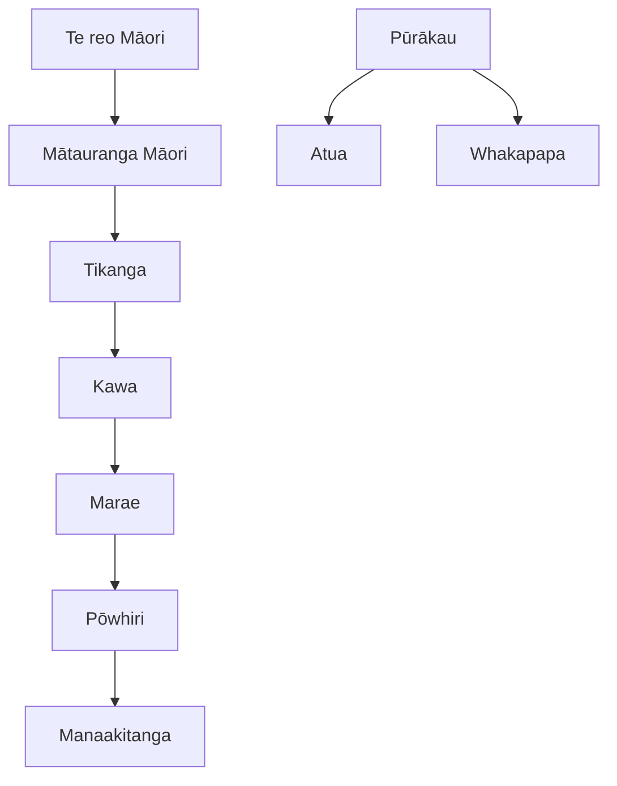

te reo Māori、pūrākau、atua 與 marae 實踐，呈現語言、知識、地方與社會關係如何相互支持。學習時保留不同 iwi 的語言、敘事與 kawa 差異。

```mermaid
flowchart TD
  TR[Te reo Māori] --> MK[Mātauranga Māori]
  PU[Pūrākau] --> AT[Atua]
  PU --> WP[Whakapapa]
  MK --> TK[Tikanga]
  TK --> KW[Kawa]
  KW --> MR[Marae]
  MR --> PO[Pōwhiri]
  PO --> MA[Manaakitanga]
```

建議閱讀路徑：[[Te_reo_Māori]] → [[Mātauranga_Māori]] → [[Pūrākau]] → [[Tikanga]] → [[Marae]] → [[Pōwhiri]]。
