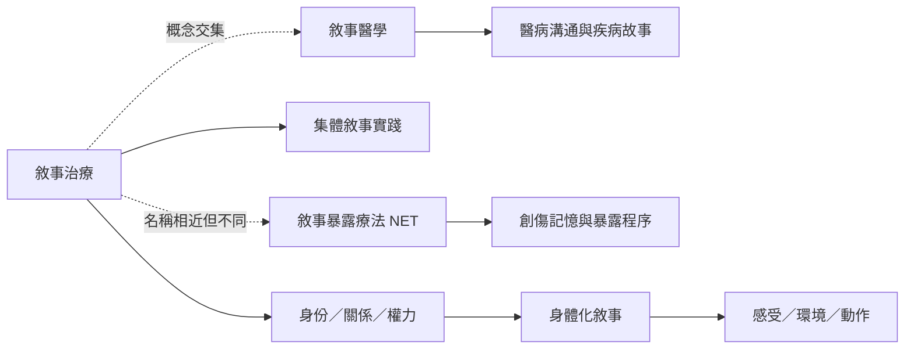

本地圖辨別敘事治療與幾個相鄰領域的交集與差異。共同使用故事語言，不等於理論、程序或療效證據相同。敘事暴露療法以創傷記憶處理為主要機制；敘事醫學關注臨床照護者理解患者故事的能力；身體化敘事提醒我們，故事也透過身體與環境被經驗。

```mermaid
graph LR
  A[敘事治療] --> B[身份／關係／權力]
  A --> C[集體敘事實踐]
  A -.概念交集.-> D[敘事醫學]
  A -.名稱相近但不同.-> E[敘事暴露療法 NET]
  D --> F[醫病溝通與疾病故事]
  E --> G[創傷記憶與暴露程序]
  B --> H[身體化敘事]
  H --> I[感受／環境／動作]
```

對照條目：[[敘事暴露療法的實證結果不能直接算作敘事治療的證據]]、[[身體與感受不能只被文本隱喻取代]]、[[為敘事實踐建立不過度簡化的成效指標]]。
