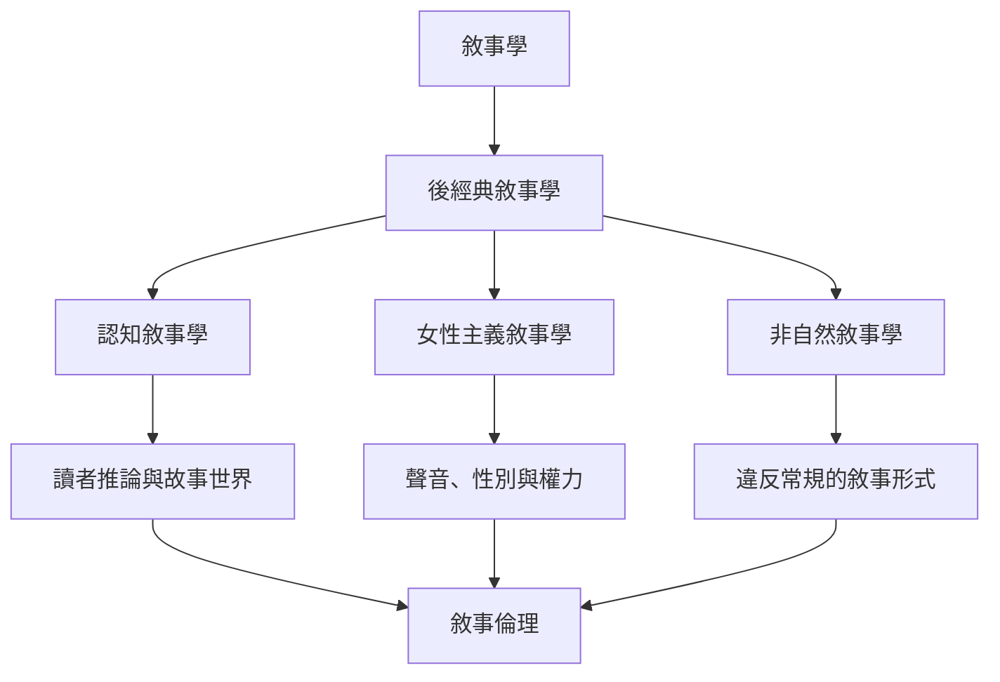

後經典取徑不是單一理論，而是從不同問題切入敘事的研究群，並共同檢查形式、讀者與社會脈絡。

```mermaid
flowchart TD
  A[敘事學] --> B[後經典敘事學]
  B --> C[認知敘事學]
  B --> D[女性主義敘事學]
  B --> E[非自然敘事學]
  C --> F[讀者推論與故事世界]
  D --> G[聲音、性別與權力]
  E --> H[違反常規的敘事形式]
  F --> I[敘事倫理]
  G --> I
  H --> I
```

此圖中的概念可沿著不同路徑交叉閱讀：[[後經典敘事學]]、[[認知敘事學]]、[[女性主義敘事學]]、[[非自然敘事學]]、[[敘事倫理]]、[[敘事學]]。

* 延伸閱讀：[[Narratology|敘事學導讀]]
