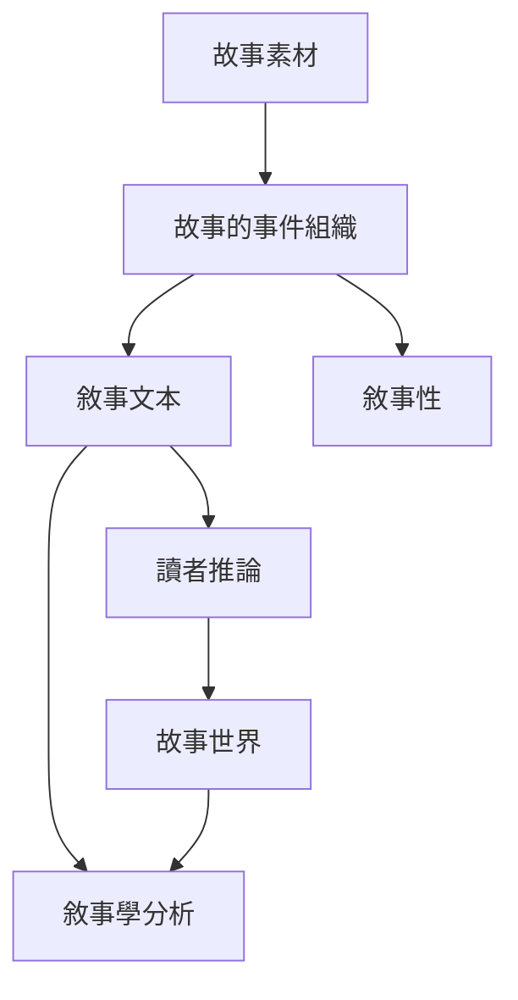

這張地圖把敘事的基本層次連在一起：事件材料如何構成故事，故事如何被文本安排，讀者又如何推論故事世界。

```mermaid
flowchart TD
  A[故事素材] --> B[故事的事件組織]
  B --> C[敘事文本]
  C --> D[讀者推論]
  D --> E[故事世界]
  B --> F[敘事性]
  C --> G[敘事學分析]
  E --> G
```

此圖中的概念可沿著不同路徑交叉閱讀：[[故事]]、[[故事素材]]、[[敘事文本]]、[[敘事性]]、[[故事世界]]、[[敘事學]]。

* 延伸閱讀：[[Narratology|敘事學導讀]]
