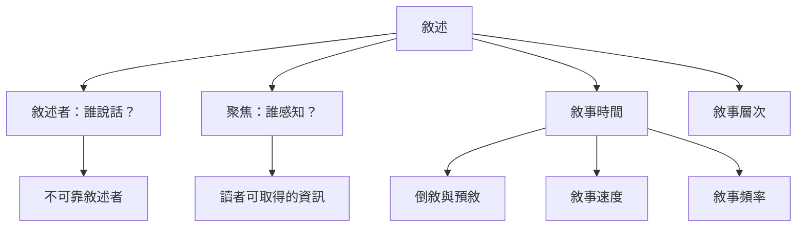

此圖聚焦三個最常被混淆的問題：誰說話、誰感知，以及事件如何被安排成敘事時間。

```mermaid
flowchart TD
  A[敘述] --> B[敘述者：誰說話？]
  A --> C[聚焦：誰感知？]
  A --> D[敘事時間]
  D --> E[倒敘與預敘]
  D --> F[敘事速度]
  D --> G[敘事頻率]
  A --> H[敘事層次]
  B --> I[不可靠敘述者]
  C --> J[讀者可取得的資訊]
```

此圖中的概念可沿著不同路徑交叉閱讀：[[敘述]]、[[敘述者]]、[[聚焦]]、[[敘事時間]]、[[倒敘與預敘]]、[[敘事速度]]、[[敘事頻率]]、[[敘事層次]]、[[不可靠敘述者]]。

* 延伸閱讀：[[Narratology|敘事學導讀]]
