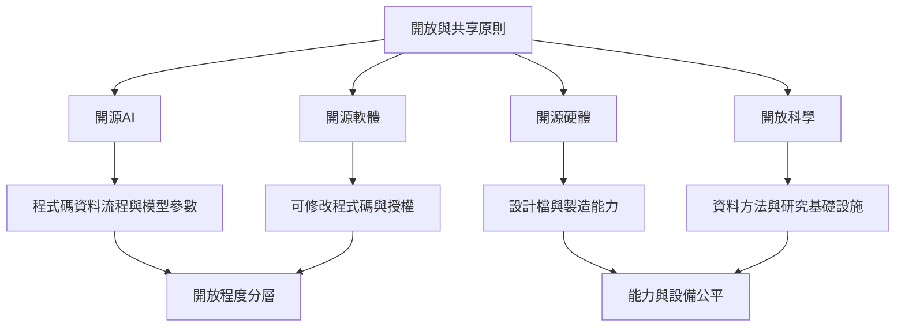

開源原則不只適用軟體，也延伸至硬體、研究方法、資料與人工智慧。但不同資源的法律、倫理與物質條件不同，不能把軟體授權機械式套用到所有知識。

```mermaid
flowchart TD
 A[開放與共享原則] --> B[開源軟體]
 A --> C[開源硬體]
 A --> D[開放科學]
 A --> E[開源AI]
 B --> F[可修改程式碼與授權]
 C --> G[設計檔與製造能力]
 D --> H[資料方法與研究基礎設施]
 E --> I[程式碼資料流程與模型參數]
 G --> J[能力與設備公平]
 H --> J
 I --> K[開放程度分層]
 F --> K
```

閱讀[[開放知識需要能力建構而不只是公開檔案]]與[[開放科學與開源共享相互支援但範圍不同]]，並比較軟體、硬體和 AI 的開放條件。

參照：[[開源硬體]]、[[開放科學]]、[[開源人工智慧需要分層描述開放程度]]、[[數位公共財]]。
